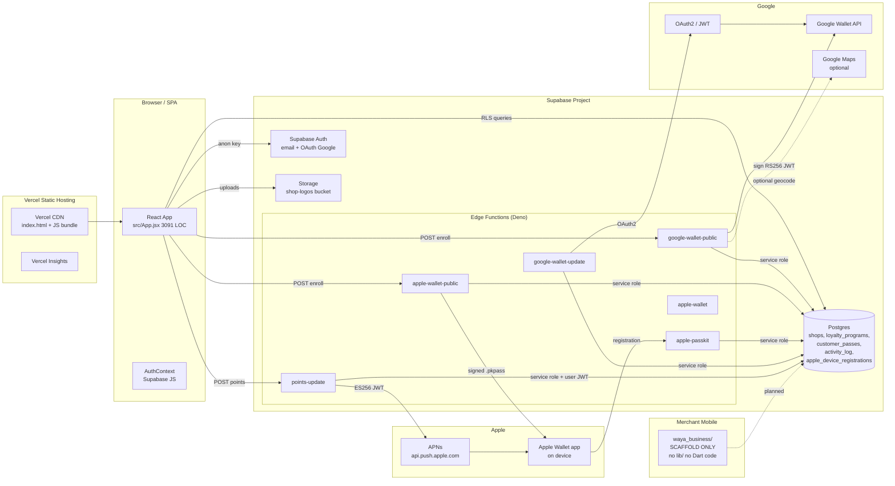
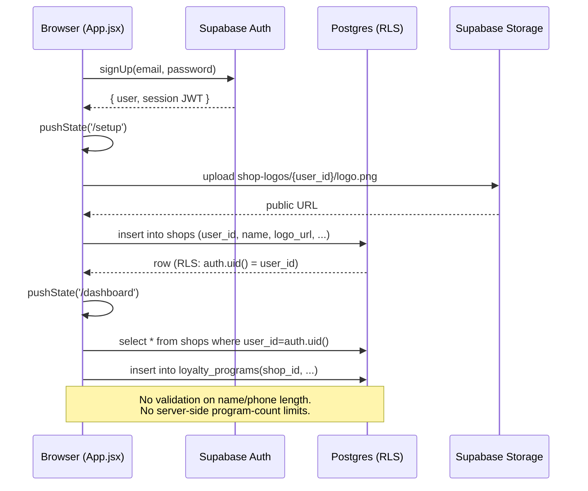
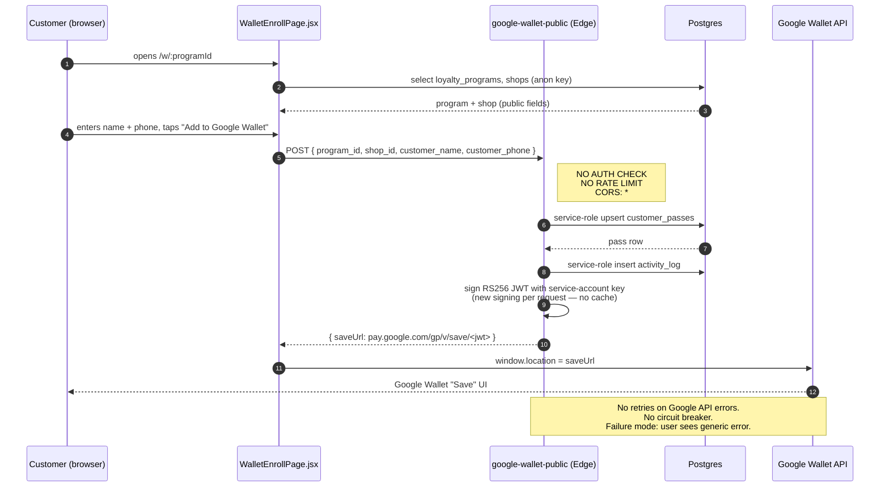
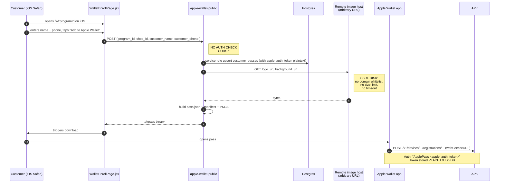
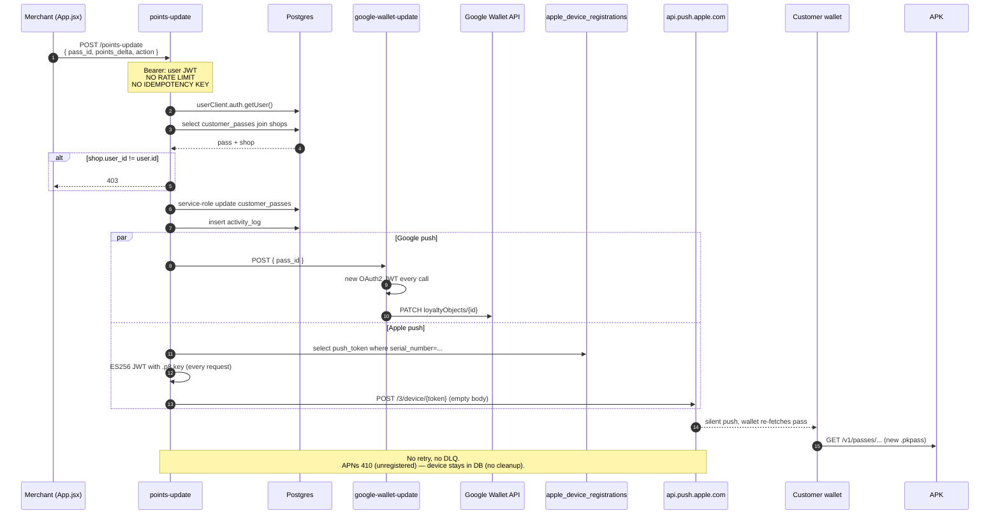
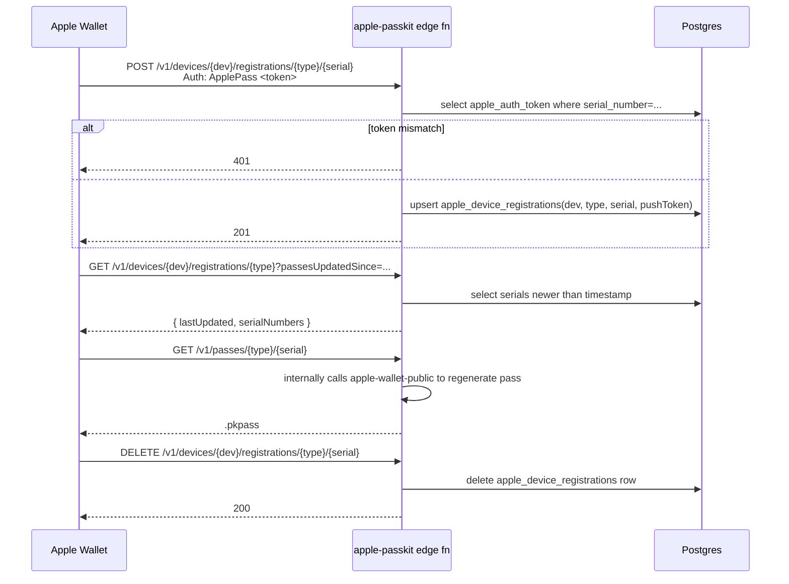
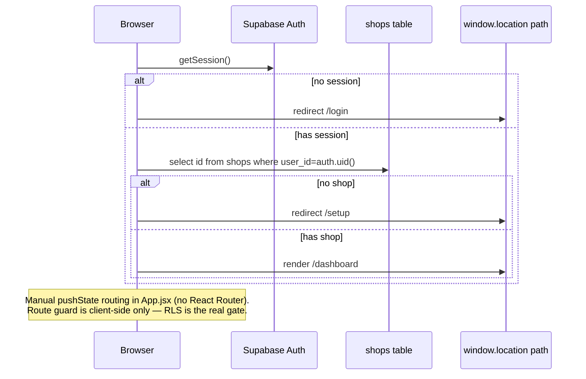

# Waya — Full Technical Audit & Architecture Review
**Date:** 2026-04-15
**Repo:** `github.com/abobndrthefirst/wayav21` (master branch)
**Scope:** React/Vite website, Supabase (Postgres + Edge Functions), Flutter merchant app scaffold, Google Wallet + Apple Wallet integrations, Vercel hosting.

---

## 1. Executive Summary

Waya is a loyalty-and-rewards platform for Saudi businesses. The production stack today is:

- A **single-page React 19 / Vite 8 site** deployed on Vercel (`src/App.jsx`, 3,091 LOC monolith).
- A **Supabase project** providing Postgres (with RLS), Auth, Storage, and six Deno **Edge Functions**.
- **Google Wallet** and **Apple Wallet / PassKit** integrations for customer loyalty passes, plus **APNs** push updates.
- A Flutter project folder `waya_business/` which is **only a scaffold — there is no `lib/` directory and no shipped Dart code** (merchant mobile app is not yet implemented).

**Headline findings:**

1. **Critical security gaps.** The Supabase anon key is hardcoded in the browser bundle; two edge functions (`google-wallet-public`, `apple-wallet-public`) accept unauthenticated POSTs with PII and no rate limiting; CORS is wildcard `*` on every function; Apple PassKit auth tokens are stored in plaintext.
2. **Architectural fragility.** Business logic lives in one 3,000-line file with manual `window.history.pushState` routing, three partially overlapping codebases (`src/`, `wayawebv2/`, `wayav21-updates/`), and a schema drift between `waya_business/supabase_migration.sql` (`stores/customers/transactions/rewards`) and the code, which actually queries `shops/loyalty_programs/customer_passes/activity_log`.
3. **No test coverage.** There is no unit, integration, or end-to-end test anywhere in the repo. ESLint is the only automated check.
4. **Mobile app is vaporware.** `waya_business/` has `pubspec.yaml` with Supabase + fl_chart + qr_flutter dependencies but **zero Dart source files**. Stakeholders should not assume the merchant app exists.
5. **Scale target (3M customers, 5K merchants) is unachievable in current form.** Not because Supabase cannot host that volume (it can, with planning), but because the code has no caching, no batching, no pagination on list views, no rate limiting, no observability, and regenerates Google OAuth + APNs JWTs on every request. The `get_monthly_growth` RPC does a full scan per call. Logos are fetched from arbitrary URLs (SSRF) on every wallet generation.

This report is specific, file/line-cited, and opinionated. Fixes are prioritized below.

---

## 2. Architecture Summary

### 2.1 High-level component map



### 2.2 Responsibility matrix

| Component | Responsibility | Owner/file | Critical dependencies |
|---|---|---|---|
| React SPA (`src/App.jsx`) | Landing, auth, merchant dashboard, loyalty config, wallet enroll UI | 1 monolith file | Supabase JS, framer-motion |
| `src/components/WalletEnrollPage.jsx` | Customer-facing enroll (reads `/w/:programId` route) | 202 LOC | `google-wallet-public`, `apple-wallet-public` |
| `src/components/LoyaltyWizard.jsx` | Loyalty program create/edit | 590 LOC | `loyalty_programs` table |
| `src/components/ProgramsList.jsx` | Merchant list of programs | 373 LOC | `loyalty_programs` table |
| Supabase Postgres | Source of truth | `waya_business/supabase_migration.sql` (partial — drifted) | — |
| `google-wallet-public` | Create Google Wallet class + object, return save URL | `supabase/functions/google-wallet-public/index.ts` | Google Wallet API |
| `apple-wallet-public` | Build and sign `.pkpass` | `supabase/functions/apple-wallet-public/index.ts` | node-forge, Apple certs |
| `apple-passkit` | Apple's web service spec (device register, pass fetch) | `supabase/functions/apple-passkit/index.ts` | `customer_passes`, `apple_device_registrations` |
| `google-wallet-update` | PATCH Google loyalty object points | `supabase/functions/google-wallet-update/index.ts` | Google Wallet API, OAuth2 |
| `points-update` | Merchant mutation API: stamp/redeem + push to Google + APNs | `supabase/functions/points-update/index.ts` | APNs, `google-wallet-update` |
| `apple-wallet` | Internal helper (not publicly wired) | `supabase/functions/apple-wallet/index.ts` | — |
| Vercel | Static hosting + CDN + analytics | `vercel.json` (SPA rewrite) | — |
| Flutter app | *(planned)* merchant POS/scanner | `waya_business/pubspec.yaml` | — (no code) |

---

## 3. Mermaid Sequence Diagrams

### 3.1 Merchant signup → first program creation



### 3.2 Customer enrollment → Google Wallet save



### 3.3 Customer enrollment → Apple Wallet (.pkpass)



### 3.4 Merchant stamps customer → Google + Apple pass update



### 3.5 Customer Apple Wallet lifecycle (webServiceURL)



### 3.6 Auth + SPA route guard



---

## 4. Service Inventory

### 4.1 Database tables (actually used in code)

| Table | Declared in migration.sql? | Used by |
|---|---|---|
| `shops` | ❌ (migration has `stores` instead) | App.jsx, all edge functions, WalletEnrollPage |
| `loyalty_programs` | ❌ | LoyaltyWizard, ProgramsList, edge functions |
| `customer_passes` | ❌ | All wallet edge functions, points-update |
| `activity_log` | ❌ | google-wallet-public, apple-wallet-public, points-update |
| `apple_device_registrations` | ❌ | apple-passkit, points-update |
| `stores`, `customers`, `transactions`, `rewards` | ✅ | **Unused by code.** Schema drift. |

**Gap:** The only migration file in the repo describes a schema the application does not use. Either production Postgres is in a state only Supabase dashboard knows about, or there is a second migration history kept out of git. This is a severe documentation/ownership gap.

### 4.2 Edge functions

| Function | Method | Auth | Input | Side effects | Externals |
|---|---|---|---|---|---|
| `google-wallet-public` | POST | **None** | program_id/shop_id, customer_name, customer_phone | upsert customer_passes; insert activity_log | Sign RS256 JWT → Google Wallet save link |
| `apple-wallet-public` | POST | **None** | program_id/shop_id, customer_name, customer_phone | upsert customer_passes; insert activity_log; fetch remote images (SSRF) | PKCS#7 sign → .pkpass |
| `apple-passkit` | GET/POST/DELETE/OPTIONS | `ApplePass <token>` (plaintext match) | device_library_identifier, pass_type_identifier, serial_number, pushToken | upsert/delete apple_device_registrations | Calls apple-wallet-public |
| `google-wallet-update` | POST | **None** | pass_id | update customer_passes.updated_at | OAuth2 + PATCH Google |
| `points-update` | POST | Bearer user JWT | pass_id, points_delta, stamps_delta, set_points, set_tier, action | update customer_passes; insert activity_log | APNs ES256 JWT; calls google-wallet-update |
| `apple-wallet` | (unclear) | — | — | — | Helper; not wired from client |

### 4.3 External integrations

- **Google Wallet API** — service-account RS256 JWT per request; origins claim hardcoded incl. `http://localhost:5173`.
- **Apple PassKit** — cert + key + WWDR + org name from env; PKCS#7 via node-forge.
- **APNs** — ES256 JWT (team id + key id + .p8 key); HTTP/2 to `api.push.apple.com/3/device/{token}`.
- **Google Maps** — optional geocode for shop address (URL-based, no key audit available in the sampled lines).
- **Supabase Auth** — email/password + Google OAuth.
- **Vercel Insights** — `/_vercel/insights/script.js` in index.html.

### 4.4 Background jobs / cron / queues

**None.** There are no scheduled jobs, no queues, no workers. Every action is synchronous in an edge function or in the browser.

Consequences:
- No retry for failed APNs pushes.
- No dead letter queue for Google Wallet PATCH failures.
- No cleanup job for stale `apple_device_registrations` (APNs 410-unregistered devices accumulate forever).
- No batching of push updates — a merchant who stamps 500 cards at a bulk event issues 500 serial APNs JWTs.

---

## 5. Gap Analysis

### 5.1 Architecture / maintainability

| # | Finding | Evidence | Severity |
|---|---|---|---|
| A1 | Monolithic 3,091-LOC `App.jsx` mixing landing page, auth, dashboard, loyalty, wallet, privacy/terms | `src/App.jsx` | High |
| A2 | Three parallel codebases: `src/`, `wayawebv2/`, `wayav21-updates/` with overlapping features; unclear which is canonical | repo root | High |
| A3 | Schema drift: `supabase_migration.sql` defines `stores/customers/transactions/rewards`, code uses `shops/loyalty_programs/customer_passes/activity_log` | migration file vs App.jsx | High |
| A4 | Dead files: `src/App.tsx`, `src/main.tsx`, `src/pages/Home.tsx`, `src/pages/Login.tsx`, `src/pages/Signup.tsx`, `src/lib/AuthContext.tsx` (not imported by deployed entry) | Vite resolves `main.jsx` → `App.jsx`; the `.tsx` files are orphans | Medium |
| A5 | Manual `window.history.pushState` routing with no error boundary; a thrown error in one tab blanks the whole app | App.jsx route switch | Medium |
| A6 | No shared types between client and edge functions (edge is Deno TS, client is JSX — no shared contract) | — | Medium |
| A7 | Flutter app promised but has zero Dart code (no `lib/`, only scaffolding and a boilerplate `widget_test.dart`) | `waya_business/` listing | High |
| A8 | No README explaining the system (only an `APPLE_WALLET_SETUP.md` and a stub `README.md`) | repo root | Medium |

### 5.2 Reliability & performance

| # | Finding | Severity |
|---|---|---|
| R1 | Google OAuth2 token is re-signed on every `google-wallet-update` call. No cache, no reuse. | High |
| R2 | APNs ES256 JWT is re-signed for every push in `points-update`. Apple recommends token reuse for up to ~1h. | High |
| R3 | No retries, no exponential backoff, no circuit breaker around Google Wallet or APNs. | High |
| R4 | No idempotency key on `points-update`. Double-tap at POS = double stamp. | Critical (fraud surface) |
| R5 | `get_monthly_growth` RPC scans `transactions` per call with no prepared aggregate — at scale this is O(N) per merchant dashboard load. | High |
| R6 | List views (programs, customer passes) have no pagination visible. | High |
| R7 | N+1 on dashboard when fetching shop + programs + recent passes separately. | Medium |
| R8 | Wallet generation fetches remote logo/background images on every request — no CDN cache, no CDN push to a Supabase-hosted asset. | High |
| R9 | No health-check endpoint, no `/status` route. | Medium |
| R10 | No structured logging. Edge functions use `console.log`; no correlation IDs; no trace propagation. | High |
| R11 | No alerting. Supabase logs exist but nothing routes errors to Slack/email. | High |
| R12 | No load shedding / timeouts configured on edge functions (uses Deno runtime defaults). | Medium |

### 5.3 Deployment risks

- `vercel.json` rewrites everything to `index.html` including `/api/*` — if an API proxy is ever added here it will be masked.
- Both `vite.config.js` and `vite.config.ts` exist; Vite's resolution order can surprise future contributors.
- Flutter artifacts (`waya_business/ios`, `macos`, `windows`, `linux`) ship in the web repo and bloat git.

---

## 6. Cybersecurity Assessment

### 6.1 Findings with severity

| ID | Finding | Severity | Evidence |
|---|---|---|---|
| S1 | Supabase anon JWT hardcoded in source (`src/App.jsx:11-12` and `src/lib/supabase.ts`). Key expires in **2090** (effectively never). | **Critical** | App.jsx, supabase.ts |
| S2 | Wallet enroll functions accept PII (name + phone) with **no auth**, **no rate limit**, **CORS `*`**. Trivially abused for spam pass generation, PII enumeration if you can guess program_id UUIDs, and DoS against Apple/Google credits. | **Critical** | google-wallet-public/index.ts, apple-wallet-public/index.ts |
| S3 | `apple_auth_token` stored **plaintext** in `customer_passes`. DB leak = permanent compromise of every pass. | **Critical** | apple-passkit flow |
| S4 | SSRF in `apple-wallet-public`: arbitrary `logo_url` / `background_url` fetched server-side without domain allowlist, size cap, or timeout. Merchant-controlled input → internal network probing possible. | **High** | apple-wallet-public image fetch |
| S5 | `points-update` has no idempotency; a merchant who resubmits the same request doubles stamps. Also no per-user rate limit. | **High** | points-update/index.ts |
| S6 | Customer records (name, phone) written to `activity_log` with no retention policy and no purge. PDPL / CCPA exposure. | **High** | google-wallet-public, apple-wallet-public |
| S7 | Service-role key is used in four functions that are reachable from unauthenticated callers (wallet public + update). If a secret-pattern leak happens (log accidentally prints env), it is catastrophic. | **High** | All edge functions using `SUPABASE_SERVICE_ROLE_KEY` |
| S8 | No CSP header, no `X-Frame-Options`, no Subresource Integrity on `index.html` (other than Vercel defaults). | **Medium** | index.html |
| S9 | Relies entirely on Supabase RLS, but migration.sql RLS policies cover tables (`stores`, `customers`...) that code does not use. RLS on `shops / loyalty_programs / customer_passes / activity_log / apple_device_registrations` is **unverified from the repo**. | **High** | migration.sql vs actual tables |
| S10 | No input validation on phone/name length; `customer_phone` propagated into signed Google Wallet JWT and Apple pass serial. Malformed strings can corrupt passes. | **Medium** | edge function inputs |
| S11 | Google Wallet JWT `origins` claim hardcodes `http://localhost:5173` — usable from a local attacker's page to redirect saves. | **Medium** | google-wallet-public |
| S12 | Auth flow uses `pushState` only — no `onbeforeunload`/re-check on tab focus; stale sessions can persist. | **Low** | App.jsx |
| S13 | No WAF / bot protection in front of Supabase functions. | **Medium** | infrastructure |
| S14 | File upload (logo) path pattern `{user_id}/logo.{ext}` — extension is user-controlled. No MIME sniff, no max-size visible. Potential for uploading unexpected types to a public bucket. | **Medium** | storage path inferred |
| S15 | Privacy policy states "We do not collect financial data… will never sell or share" — but customer name + phone is shared with Google and Apple as part of pass generation. Consent UX is implicit. | **Medium (legal)** | index.html |
| S16 | No account lockout / brute-force limits beyond Supabase defaults. | **Medium** | auth |
| S17 | Personal access token was pasted in chat this session. **Treat as compromised — rotate immediately.** | **Critical** | user message |

### 6.2 Remediation outline

Critical:
1. **Rotate now:** GitHub PAT (S17), Supabase service-role key (defense in depth after service-role audit).
2. Move Supabase URL + anon key out of source into `VITE_*` env vars; rebuild CI so a public repo never leaks secrets again (S1).
3. Add authentication to `google-wallet-public` / `apple-wallet-public`: either a signed short-lived enrollment token minted server-side when the merchant publishes a program, or require a CAPTCHA + per-IP rate limit (S2).
4. Hash `apple_auth_token` (e.g. SHA-256 with a server pepper) and compare hashes in `apple-passkit` (S3).
5. Harden SSRF: restrict `fetchImage` to Supabase Storage signed URLs only; 1 MB cap; 3 s timeout; mime sniff (S4).

High:
6. Add idempotency-key header to `points-update` and deduplicate in `activity_log` (S5).
7. Write explicit RLS policies for `shops`, `loyalty_programs`, `customer_passes`, `activity_log`, `apple_device_registrations` and check them in with a new `migrations/` folder that matches reality (S9, A3).
8. Replace CORS `*` with allowlist (`trywaya.com`, `www.trywaya.com`) on all edge functions.
9. Cache Google OAuth token (55 min) and APNs JWT (50 min) in Deno KV or module-scope (R1, R2).

Medium:
10. Add CSP, HSTS, Referrer-Policy, Permissions-Policy headers via Vercel config.
11. Sign / whitelist `logo_url` in storage: merchant uploads go only to `shop-logos/{owner_id}/...`, server rejects external URLs.
12. Add automatic PII redaction + 12-month retention on `activity_log`.

---

## 7. Scalability Assessment — 3M customers, 5K merchants

### 7.1 What the scale actually looks like

Assume 3,000,000 customer_passes rows, 5,000 shops, average 50 loyalty_programs, and 1 stamp per customer per month → 3M events/month ≈ 100K/day ≈ 1.2 rps steady-state, with bursts at peak hours of maybe 50-100 rps.

**Supabase hosted Postgres can carry this** if the schema and indexes are right. The application cannot.

### 7.2 Bottlenecks today

| Layer | Status | Gap |
|---|---|---|
| DB rows | Will fit on a mid-tier Supabase plan | Indexes on `customer_passes(shop_id, last_visit_at)`, `activity_log(shop_id, created_at DESC)` — partially covered by existing migration but for wrong tables |
| DB queries | `get_monthly_growth` scans `transactions` per call | Pre-aggregate via materialized view, refresh hourly |
| Edge function cold starts | Deno edge fns cold-start ~100-300 ms | Keep warm, and cache OAuth/APNs JWTs |
| Google Wallet QPS | Google default 5 QPS per service account | Batch updates; retry with backoff; request quota increase |
| APNs throughput | HTTP/2 allows 1000s/min | Fine, but **one JWT per request today**. Reuse token |
| Apple Pass generation | PKCS#7 signing in Deno is ~50-100ms/pass | Move to async worker; pre-build on program create; serve cached bytes per-customer with interpolated serial |
| Image bandwidth | Logos re-fetched from external URLs per pass build | Force uploads to Supabase Storage; cache bytes by hash |
| Supabase connection pool | 60 connections on free tier, 500 on Pro | At 100 rps with 200ms latency = ~20 concurrent — OK if you scale Supabase plan |
| Rate limiting | None | Required before scale — otherwise one abusive caller burns APNs quota / Google quota / bills |
| Merchant dashboard | Loads full lists | Pagination (cursor on created_at DESC) |
| Client bundle | `App.jsx` 3,091 LOC single chunk | Code-split by route; lazy-load wallet + wizard |
| Observability | None | Required to even *detect* bottlenecks at scale |

### 7.3 Already-scalable pieces

- Vercel static hosting scales freely.
- Supabase Auth horizontally scales.
- Postgres storage tier covers ~1B rows without drama, provided indexes and partitioning on `transactions`/`activity_log` by month.
- React SPA is stateless per user.

### 7.4 What must change before 3M

1. Partition `activity_log` (and eventual `transactions`) by month; keep 90 days hot, move older to cold storage.
2. Add a message queue (Supabase PgMQ, or Upstash QStash) for wallet push updates. `points-update` should enqueue; a worker drains in batches with APNs/Google retries.
3. Add Redis (Upstash) for JWT caching, rate limiting, idempotency keys.
4. Force merchant logos into Supabase Storage; cache pass PNG binaries.
5. Pre-sign a per-customer "enrollment token" when merchant publishes a program; require that token on `google-wallet-public` / `apple-wallet-public`; token carries rate limit.
6. Materialize merchant stats (customers, stamps, redemptions) into a `shop_stats_daily` table; dashboard reads from it.
7. Observability: OpenTelemetry in edge fns, Supabase log drains to Logflare/Axiom/Datadog, Sentry on the client.
8. Rebuild the Flutter merchant app (today: doesn't exist) with batched stamp + offline queue — a POS tablet with flaky Wi-Fi will destroy a purely-online stamping UX.

---

## 8. Performance & Reliability Review

Specific code hotspots:

- `src/App.jsx` — single-chunk bundle; initial render pulls framer-motion + all pages. Lazy-load dashboard and wallet wizard via `React.lazy`.
- `supabase/functions/google-wallet-update/index.ts` — `getAccessToken()` is called per request (line ~96). Cache access token in module scope for 55 minutes.
- `supabase/functions/points-update/index.ts` — `makeApnsJwt()` per request (line ~141). Cache for 50 minutes; the Apple-recommended lifetime is ≤60 min.
- `supabase/functions/apple-wallet-public/index.ts` — `fetchImage()` per request for the same logo; introduce an in-process cache keyed by URL+ETag; better: mirror into Storage on program save and serve from there.
- `get_monthly_growth` RPC — replace with a materialized view refreshed via `pg_cron` every 1h.

Missing resilience patterns:

- No **retries** anywhere (Google PATCH, APNs POST, image fetch).
- No **circuit breaker** — a Google Wallet outage will fail every `points-update`, with no fallback to "queue and retry".
- No **idempotency** — duplicate client submission silently produces duplicate side effects.
- No **graceful degradation** — if Apple cert is expired, `apple-wallet-public` 500s silently.

Missing observability:

- No Sentry, no Datadog, no OTel spans.
- No structured request IDs tying a customer action across `points-update → google-wallet-update → APNs`.
- No merchant-level metrics (stamps/hour, failures) visible in a dashboard.
- Supabase native logs are the only safety net.

---

## 9. QA & Testing Assessment

### 9.1 Current state

**Zero tests** in the repo except for the unmodified Flutter template test file. ESLint is the only check.

Checklist:
- Unit tests: 0
- Integration tests: 0
- End-to-end: 0
- Load/stress: 0
- Security tests (SAST/DAST): 0
- CI: not visible (no `.github/workflows`, no `vercel.json` build hooks beyond defaults)

### 9.2 Proposed QA strategy

Framework split:

- **Unit (Vitest)** — pure helpers: route resolver in App.jsx, price / stamp calculators, phone validators, JWT builders in edge functions.
- **Integration (Vitest + Supabase local stack)** — hitting real edge functions against a local Supabase, with mocked Google/Apple.
- **End-to-end (Playwright)** — signup → setup → create program → open enroll link → add to Google Wallet (assert redirect URL); merchant stamps; merchant redeems.
- **Security (semgrep + npm audit + Supabase `pg_advisor`)** — run in CI.
- **Load (k6)** — scenario: 200 enrollments/sec for 5 minutes; 50 stamps/sec across 500 merchants.
- **Contract** — JSON schema for each edge function request/response, with a `zod`/`valibot` validator in the function.

### 9.3 Critical test scenarios

Customer:
1. Enroll twice with same phone → single `customer_passes` row, no duplicate activity log.
2. Enroll with 1,000-char name → rejected with 400.
3. Enroll on iOS Safari → .pkpass valid, signatures match WWDR.
4. Enroll on Android Chrome → Google save link opens, new loyalty object created.
5. Invalid program_id → 404 (not 500).

Merchant:
6. Create program with missing fields → 400.
7. Upload 30 MB logo → rejected.
8. Stamp via `points-update` twice with same idempotency key → one effect.
9. Delete program with active customers → cascade or refusal with clear error.
10. Cannot access another merchant's shop via a forged JWT (RLS test).

Payments / flows:
11. APNs returns 410 → device registration deleted.
12. Google Wallet returns 429 → retry w/ jitter, eventual success or DLQ.
13. Apple cert within 30 days of expiry → alert.
14. Supabase service-role key revoked → functions fail loudly, not silently.

Auth:
15. Password ≤ 5 chars → rejected client-side and server-side.
16. Google OAuth cancel → returns to `/login` with no ghost session.
17. Signed-out user hitting `/dashboard` → redirect `/login` (not white screen).

Edge cases:
18. RTL vs LTR label truncation on dashboard (`data-stat-value`).
19. User uploads SVG with embedded script → rejected.
20. User spams 10,000 enrollments → rate limiter returns 429.

### 9.4 CI/CD

Minimum viable pipeline:
```yaml
- run: npm ci
- run: npm run lint
- run: npx tsc --noEmit
- run: npx vitest run
- run: npx playwright install --with-deps && npx playwright test
- run: semgrep scan --config auto
- run: npm audit --audit-level=high
```

---

## 10. Risk Matrix

| Risk | Likelihood | Impact | Rating | Owner |
|---|---|---|---|---|
| PAT leak in chat (S17) | Happened | High (repo tamper) | **Critical — rotate now** | sully |
| Wallet functions unauthenticated (S2) | High | High (abuse, cost, PII) | **Critical** | backend |
| Hardcoded anon key (S1) | High | Medium (still anon) | High | frontend |
| Apple token plaintext (S3) | Medium | High (DB breach) | High | backend |
| SSRF in image fetch (S4) | Low | High | High | backend |
| Idempotency missing (S5) | High | Medium (fraud/dispute) | High | backend |
| Schema drift (A3) | Confirmed | Medium (onboarding, ops) | High | data |
| Flutter app does not exist (A7) | Confirmed | High (missed GTM) | High | product |
| No tests (Section 9) | Confirmed | Medium (regression cost) | High | eng |
| No observability (R10-R11) | Confirmed | Medium (blind at scale) | High | eng |
| Google/APNs JWTs re-signed (R1-R2) | Confirmed | Low → Medium at scale | Medium | backend |
| `get_monthly_growth` RPC full scan (R5) | Confirmed | Medium at scale | Medium | data |
| No rate limiting (R4, 7.2) | Confirmed | High under abuse | High | backend |
| CORS `*` (S8) | Confirmed | Medium | Medium | backend |

---

## 11. Prioritized Recommendations & Action Plan

### 11.1 Immediate (this week — stop-the-bleeding)

1. **Rotate GitHub PAT** that was pasted in chat, and the Supabase service-role key.
2. Move `SUPABASE_URL` and `SUPABASE_ANON_KEY` to `VITE_*` env vars; delete hardcoded strings in `App.jsx` and `src/lib/supabase.ts`.
3. Lock CORS on all edge functions to `https://trywaya.com`, `https://www.trywaya.com`.
4. Add simple per-IP rate limit (Upstash Redis + sliding window) to `google-wallet-public` and `apple-wallet-public`: 10 req / 10 min.
5. Hash `apple_auth_token` before storing; update `apple-passkit` to hash-compare.
6. Enforce input validation in all edge functions: `customer_name` ≤ 80, `customer_phone` matches KSA pattern (e.g. `^\+?9665\d{8}$`), `program_id` is UUID.
7. Write and commit the **real** RLS policies (`shops`, `loyalty_programs`, `customer_passes`, `activity_log`, `apple_device_registrations`) into a versioned `supabase/migrations/` folder.
8. Delete `wayawebv2/`, `wayav21-updates/`, and the dead `.tsx` files; keep a single canonical `src/App.jsx` (or start splitting it — see 11.3).
9. Add an idempotency-key check in `points-update` using `activity_log (shop_id, client_request_id UNIQUE)` column.

### 11.2 Short-term (next 2-6 weeks)

10. Cache Google OAuth token (module scope, 55 min TTL) and APNs JWT (50 min TTL).
11. Replace `get_monthly_growth` with a materialized view `shop_monthly_stats` refreshed hourly via `pg_cron`.
12. Mirror merchant logos into Supabase Storage on save; never fetch external URLs from edge functions.
13. Wire Sentry on the React app and on all edge functions (Deno SDK).
14. Add structured logging with request IDs; drain Supabase logs to Axiom or Logflare.
15. Start a Playwright E2E suite covering the 17 scenarios in §9.3; gate Vercel deploys on it.
16. Split `App.jsx` by route — at minimum, lazy-load `LoyaltyWizard`, `WalletEnrollPage`, dashboard tabs.
17. Add a `/api/health` edge function returning Supabase + Google + Apple reachability, and uptime-monitor it externally.
18. Introduce a nightly cleanup job: delete `apple_device_registrations` where last APNs response was 410 more than 7 days ago.
19. Decide: either build the Flutter merchant app (at least a scanning + stamping MVP) or remove `waya_business/` from the repo until it is real.

### 11.3 Long-term (3-6 months, before 3M customer scale)

20. Introduce a queue (Supabase PgMQ or Upstash QStash) and refactor `points-update` to: persist → enqueue push → worker drains to Google + APNs with retries, backoff, DLQ.
21. Partition `activity_log` and future `transactions` tables by month; archive > 90 days to cold storage (S3 + Parquet).
22. Move the monolith React app to route-based code splitting + server-rendered landing (Next.js or Astro for `index.html`), keeping the dashboard as an SPA island.
23. Build a real admin panel (internal tool — Retool or bespoke) with role-based access; stop logging in as the merchant to inspect data.
24. Implement a proper merchant enrollment token model: when a program is published, server mints a signed token; `/w/:programId?t=...`; wallet endpoints only accept requests bearing a valid token.
25. Add a WAF / bot filter (Cloudflare in front of Vercel, or Supabase-level) before launching a public campaign.
26. Full threat model review against PDPL (Saudi Personal Data Protection Law) + GDPR (if EU customers). Add consent UI, data-subject export and deletion endpoints.
27. Contract tests between the (future) Flutter app and edge functions; generate a typed client from a single schema.

---

## 12. What is still unknown from the repo

Be explicit about the blind spots so ops stakeholders know where to look next:

- Actual production RLS policies on `shops`, `loyalty_programs`, `customer_passes`, `activity_log`, `apple_device_registrations`. Repo only ships migration for unused tables.
- Apple cert expiry dates and WWDR version.
- Google Wallet service-account quota and issuer ID.
- Storage bucket policies (public vs signed URL).
- Whether any cron jobs exist in Supabase `pg_cron`.
- Whether Supabase auth has rate limiting beyond defaults.
- Any custom domain + TLS setup on `trywaya.com`.
- Whether there is a separate staging Supabase project.
- Vercel environment variables and preview-deploy config.

Anything above should be confirmed by opening the Supabase + Vercel dashboards before a launch readiness sign-off.

---

*End of report. File: `WAYA_TECHNICAL_AUDIT.md`. Render the Mermaid diagrams in any GitHub-compatible markdown viewer (Obsidian, VS Code + Markdown Preview Mermaid, GitHub web).*
